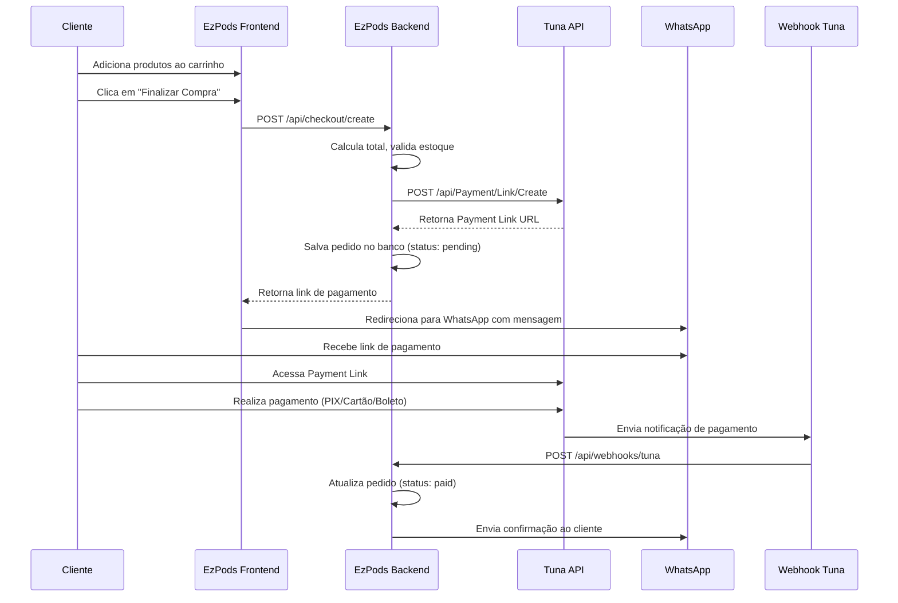

# 🚀 Integração Tuna Payment Gateway - EzPods

## 📋 Visão Geral

Este documento descreve a integração do gateway de pagamento **Tuna** com o site EzPods, substituindo o checkout tradicional por um fluxo de pagamento via **WhatsApp** com Payment Links.

---

## 🎯 Estratégia de Integração

### Fluxo Atual vs Fluxo Proposto

**❌ Fluxo Atual:**
```
Carrinho → Checkout no Site → Pagamento → Confirmação
```

**✅ Fluxo Proposto (Tuna + WhatsApp):**
```
Carrinho → Gerar Payment Link (Tuna) → Enviar via WhatsApp → Cliente Paga → Webhook Confirma → Pedido Processado
```

---

## 🔑 Conceitos Principais da Tuna

### 1. **Payment Link**
- Link de pagamento único gerado para cada pedido
- Suporta múltiplos métodos: **PIX**, **Cartão de Crédito**, **Boleto**, **Bitcoin**
- Pode ser compartilhado via WhatsApp, Email, SMS
- Expira após período configurável
- Status: `active`, `used`, `expired`

### 2. **Métodos de Pagamento Suportados**

| Método | Descrição | Tempo de Confirmação |
|--------|-----------|---------------------|
| **PIX** | Pagamento instantâneo | Imediato |
| **Cartão de Crédito** | Parcelamento disponível | 1-2 dias úteis |
| **Boleto** | Pagamento offline | 1-3 dias úteis |
| **Bitcoin** | Criptomoeda | Variável |

### 3. **Webhooks**
- Notificações automáticas de mudança de status
- Enviadas para URL configurada no Console Tuna
- Payload contém: `status`, `paymentId`, `amount`, `method`

---

## 🏗️ Arquitetura da Integração



---

## 💻 Implementação Técnica

### 1. Configuração Inicial

#### Variáveis de Ambiente (.env)
```bash
# Tuna API Credentials
TUNA_API_KEY=your_api_key_here
TUNA_APP_TOKEN=your_app_token_here
TUNA_ENVIRONMENT=sandbox # ou 'production'
TUNA_API_URL=https://sandbox.tuna.uy/api # ou https://api.tuna.uy/api

# WhatsApp Configuration
WHATSAPP_BUSINESS_NUMBER=5511999999999
WHATSAPP_API_TOKEN=your_whatsapp_token

# Webhook Configuration
WEBHOOK_SECRET=your_webhook_secret_key
NEXT_PUBLIC_SITE_URL=https://ezpods.vercel.app
```

---

### 2. Criar Payment Link (Backend)

#### Endpoint: `/api/checkout/create-payment-link`

```typescript
// app/api/checkout/create-payment-link/route.ts
import { NextRequest, NextResponse } from 'next/server'

interface CartItem {
  id: string
  name: string
  price: number
  quantity: number
}

interface PaymentLinkRequest {
  items: CartItem[]
  customerName: string
  customerPhone: string
  customerEmail?: string
}

export async function POST(request: NextRequest) {
  try {
    const body: PaymentLinkRequest = await request.json()
    
    // 1. Calcular total do pedido
    const totalAmount = body.items.reduce(
      (sum, item) => sum + (item.price * item.quantity), 
      0
    )
    
    // 2. Criar descrição do pedido
    const description = body.items
      .map(item => `${item.quantity}x ${item.name}`)
      .join(', ')
    
    // 3. Gerar ID único do pedido
    const orderId = `EZPODS-${Date.now()}`
    
    // 4. Criar Payment Link na Tuna
    const tunaResponse = await fetch(
      `${process.env.TUNA_API_URL}/Payment/Link/Create`,
      {
        method: 'POST',
        headers: {
          'Content-Type': 'application/json',
          'x-api-key': process.env.TUNA_API_KEY!,
          'x-app-token': process.env.TUNA_APP_TOKEN!,
        },
        body: JSON.stringify({
          title: `Pedido EzPods - ${orderId}`,
          description: description,
          amount: totalAmount,
          orderId: orderId,
          expirationPeriod: 24, // 24 horas
          paymentMethods: ['PIX', 'CreditCard', 'Boleto'],
          maxInstallments: 3, // Máximo 3x no cartão
          customer: {
            name: body.customerName,
            phone: body.customerPhone,
            email: body.customerEmail,
          },
          metadata: {
            source: 'ezpods-website',
            items: JSON.stringify(body.items),
          }
        })
      }
    )
    
    if (!tunaResponse.ok) {
      throw new Error('Erro ao criar payment link na Tuna')
    }
    
    const tunaData = await tunaResponse.json()
    
    // 5. Salvar pedido no banco de dados
    const order = await saveOrderToDatabase({
      orderId,
      customerId: body.customerPhone,
      items: body.items,
      totalAmount,
      paymentLinkId: tunaData.id,
      paymentLinkUrl: tunaData.url,
      status: 'pending',
      createdAt: new Date(),
    })
    
    // 6. Retornar link de pagamento
    return NextResponse.json({
      success: true,
      orderId,
      paymentLink: tunaData.url,
      whatsappMessage: generateWhatsAppMessage(
        body.customerName,
        orderId,
        totalAmount,
        tunaData.url
      ),
    })
    
  } catch (error) {
    console.error('Erro ao criar payment link:', error)
    return NextResponse.json(
      { success: false, error: 'Erro ao processar pagamento' },
      { status: 500 }
    )
  }
}

// Função auxiliar para gerar mensagem do WhatsApp
function generateWhatsAppMessage(
  customerName: string,
  orderId: string,
  amount: number,
  paymentLink: string
): string {
  return encodeURIComponent(
    `Olá ${customerName}! 🎉\n\n` +
    `Seu pedido *${orderId}* foi criado com sucesso!\n` +
    `Valor total: *R$ ${amount.toFixed(2)}*\n\n` +
    `Para finalizar, clique no link abaixo e escolha sua forma de pagamento:\n` +
    `${paymentLink}\n\n` +
    `✅ PIX (instantâneo)\n` +
    `💳 Cartão de Crédito (até 3x)\n` +
    `📄 Boleto\n\n` +
    `Qualquer dúvida, estamos à disposição!\n` +
    `EzPods - Os melhores pods de SP 🚀`
  )
}

// Função para salvar pedido no banco
async function saveOrderToDatabase(orderData: any) {
  // Implementar com seu banco de dados (PostgreSQL)
  // Exemplo usando pg:
  const query = `
    INSERT INTO orders (
      order_id, customer_id, items, total_amount, 
      payment_link_id, payment_link_url, status, created_at
    ) VALUES ($1, $2, $3, $4, $5, $6, $7, $8)
    RETURNING *
  `
  // Execute query...
  return orderData
}
```

---

### 3. Frontend - Página do Carrinho

#### Atualizar `/app/carrinho/page.tsx`

```typescript
const handleCheckout = async () => {
  try {
    setIsLoading(true)
    
    // Validar dados do cliente
    if (!customerName || !customerPhone) {
      alert('Por favor, preencha seus dados')
      return
    }
    
    // Criar payment link
    const response = await fetch('/api/checkout/create-payment-link', {
      method: 'POST',
      headers: { 'Content-Type': 'application/json' },
      body: JSON.stringify({
        items: cartItems,
        customerName,
        customerPhone,
        customerEmail,
      })
    })
    
    const data = await response.json()
    
    if (data.success) {
      // Redirecionar para WhatsApp com mensagem pré-formatada
      const whatsappUrl = `https://wa.me/${process.env.NEXT_PUBLIC_WHATSAPP_NUMBER}?text=${data.whatsappMessage}`
      
      // Abrir WhatsApp em nova aba
      window.open(whatsappUrl, '_blank')
      
      // Limpar carrinho
      localStorage.removeItem('cart')
      
      // Mostrar mensagem de sucesso
      alert('Pedido criado! Enviamos o link de pagamento via WhatsApp 🎉')
      
      // Redirecionar para página de confirmação
      router.push(`/pedido/${data.orderId}`)
    }
  } catch (error) {
    console.error('Erro no checkout:', error)
    alert('Erro ao processar pedido. Tente novamente.')
  } finally {
    setIsLoading(false)
  }
}
```

---

### 4. Webhook - Receber Notificações da Tuna

#### Endpoint: `/api/webhooks/tuna`

```typescript
// app/api/webhooks/tuna/route.ts
import { NextRequest, NextResponse } from 'next/server'
import crypto from 'crypto'

export async function POST(request: NextRequest) {
  try {
    const body = await request.json()
    
    // 1. Validar assinatura do webhook (segurança)
    const signature = request.headers.get('x-tuna-signature')
    if (!validateWebhookSignature(body, signature)) {
      return NextResponse.json(
        { error: 'Invalid signature' },
        { status: 401 }
      )
    }
    
    // 2. Extrair dados do pagamento
    const {
      paymentId,
      orderId,
      status,
      amount,
      paymentMethod,
      customerId,
    } = body
    
    console.log('Webhook recebido:', {
      paymentId,
      orderId,
      status,
      paymentMethod,
    })
    
    // 3. Atualizar status do pedido no banco
    await updateOrderStatus(orderId, status, paymentId)
    
    // 4. Processar baseado no status
    switch (status) {
      case 'approved':
      case 'paid':
        // Pagamento confirmado
        await handlePaymentApproved(orderId, customerId)
        break
        
      case 'pending':
        // Aguardando pagamento (ex: boleto gerado)
        await handlePaymentPending(orderId, customerId)
        break
        
      case 'cancelled':
      case 'failed':
        // Pagamento cancelado/falhou
        await handlePaymentFailed(orderId, customerId)
        break
    }
    
    // 5. Retornar sucesso para Tuna
    return NextResponse.json({ received: true })
    
  } catch (error) {
    console.error('Erro ao processar webhook:', error)
    return NextResponse.json(
      { error: 'Internal server error' },
      { status: 500 }
    )
  }
}

// Validar assinatura do webhook
function validateWebhookSignature(
  payload: any,
  signature: string | null
): boolean {
  if (!signature) return false
  
  const secret = process.env.WEBHOOK_SECRET!
  const hash = crypto
    .createHmac('sha256', secret)
    .update(JSON.stringify(payload))
    .digest('hex')
  
  return hash === signature
}

// Atualizar status do pedido
async function updateOrderStatus(
  orderId: string,
  status: string,
  paymentId: string
) {
  const query = `
    UPDATE orders 
    SET status = $1, payment_id = $2, updated_at = NOW()
    WHERE order_id = $3
  `
  // Execute query...
}

// Pagamento aprovado
async function handlePaymentApproved(
  orderId: string,
  customerId: string
) {
  // 1. Atualizar estoque
  await updateProductStock(orderId)
  
  // 2. Enviar confirmação via WhatsApp
  await sendWhatsAppConfirmation(customerId, orderId)
  
  // 3. Enviar email de confirmação (opcional)
  // await sendEmailConfirmation(...)
}

// Pagamento pendente
async function handlePaymentPending(
  orderId: string,
  customerId: string
) {
  // Notificar cliente que pagamento está pendente
  await sendWhatsAppMessage(
    customerId,
    `Seu pedido ${orderId} está aguardando confirmação do pagamento. ⏳`
  )
}

// Pagamento falhou
async function handlePaymentFailed(
  orderId: string,
  customerId: string
) {
  // Notificar cliente sobre falha
  await sendWhatsAppMessage(
    customerId,
    `Houve um problema com o pagamento do pedido ${orderId}. ` +
    `Entre em contato conosco para mais informações. 📞`
  )
}
```

---

## 🗄️ Estrutura do Banco de Dados

### Tabela: `orders`

```sql
CREATE TABLE orders (
  id SERIAL PRIMARY KEY,
  order_id VARCHAR(50) UNIQUE NOT NULL,
  customer_id VARCHAR(50) NOT NULL,
  customer_name VARCHAR(255),
  customer_phone VARCHAR(20),
  customer_email VARCHAR(255),
  items JSONB NOT NULL,
  total_amount DECIMAL(10, 2) NOT NULL,
  payment_link_id VARCHAR(100),
  payment_link_url TEXT,
  payment_id VARCHAR(100),
  payment_method VARCHAR(50),
  status VARCHAR(20) DEFAULT 'pending',
  created_at TIMESTAMP DEFAULT NOW(),
  updated_at TIMESTAMP DEFAULT NOW(),
  paid_at TIMESTAMP,
  
  CONSTRAINT orders_status_check 
    CHECK (status IN ('pending', 'paid', 'cancelled', 'failed', 'expired'))
);

CREATE INDEX idx_orders_customer_id ON orders(customer_id);
CREATE INDEX idx_orders_status ON orders(status);
CREATE INDEX idx_orders_created_at ON orders(created_at DESC);
```

---

## 🔐 Segurança

### 1. **Autenticação da API**
- Usar `x-api-key` e `x-app-token` em todas as requisições
- Nunca expor credenciais no frontend

### 2. **Validação de Webhooks**
- Verificar assinatura HMAC SHA-256
- Validar origem das requisições

### 3. **Ambiente Sandbox**
- Testar em `sandbox.tuna.uy` antes de produção
- Usar credenciais de teste

---

## 📱 Integração WhatsApp

### Opções de Implementação

#### Opção 1: WhatsApp Business API (Oficial)
```typescript
// Requer conta WhatsApp Business verificada
const sendWhatsAppMessage = async (phone: string, message: string) => {
  await fetch('https://graph.facebook.com/v18.0/YOUR_PHONE_ID/messages', {
    method: 'POST',
    headers: {
      'Authorization': `Bearer ${process.env.WHATSAPP_API_TOKEN}`,
      'Content-Type': 'application/json',
    },
    body: JSON.stringify({
      messaging_product: 'whatsapp',
      to: phone,
      type: 'text',
      text: { body: message }
    })
  })
}
```

#### Opção 2: Link Direto (Mais Simples)
```typescript
// Abre WhatsApp Web/App com mensagem pré-formatada
const whatsappUrl = `https://wa.me/${phoneNumber}?text=${encodedMessage}`
window.open(whatsappUrl, '_blank')
```

---

## 🧪 Testes

### 1. Ambiente Sandbox
```bash
# URLs de Teste
API: https://sandbox.tuna.uy/api
Console: https://sandbox-console.tuna.uy
```

### 2. Cartões de Teste

| Número | Resultado |
|--------|-----------|
| 4111111111111111 | Aprovado |
| 4000000000000002 | Negado |
| 4000000000000119 | Erro de processamento |

### 3. PIX de Teste
- No sandbox, qualquer QR Code PIX será aprovado automaticamente após 30 segundos

---

## 📊 Monitoramento

### Logs Importantes
```typescript
// Registrar eventos críticos
console.log('[TUNA] Payment link created:', { orderId, amount })
console.log('[TUNA] Webhook received:', { status, paymentId })
console.log('[TUNA] Order updated:', { orderId, newStatus })
```

### Métricas para Acompanhar
- Taxa de conversão (links criados vs pagamentos confirmados)
- Tempo médio de pagamento
- Método de pagamento mais usado
- Taxa de abandono

---

## 🚀 Próximos Passos

### Fase 1: Implementação Básica ✅
- [x] Criar endpoint de payment link
- [x] Integrar com WhatsApp
- [x] Configurar webhook
- [x] Atualizar página do carrinho

### Fase 2: Melhorias
- [ ] Adicionar rastreamento de pedidos
- [ ] Implementar notificações por email
- [ ] Dashboard admin para gerenciar pedidos
- [ ] Relatórios de vendas

### Fase 3: Otimizações
- [ ] Cache de payment links
- [ ] Retry automático de webhooks
- [ ] Integração com sistema de estoque
- [ ] Programa de fidelidade

---

## 📞 Suporte Tuna

- **Email**: golive@tuna.uy
- **Documentação**: https://dev.tuna.uy
- **Console**: https://console.tuna.uy
- **Status**: https://status.tuna.uy

---

## 💡 Vantagens desta Abordagem

✅ **Simplicidade**: Cliente não precisa preencher dados de pagamento no site  
✅ **Segurança**: Tuna é PCI-DSS compliant  
✅ **Flexibilidade**: Múltiplos métodos de pagamento  
✅ **Conversão**: WhatsApp tem alta taxa de engajamento  
✅ **Rastreabilidade**: Webhooks garantem sincronização  
✅ **Mobile-First**: Perfeito para público mobile  

---

**Desenvolvido para EzPods** 🚀  
*Última atualização: 02/10/2025*
