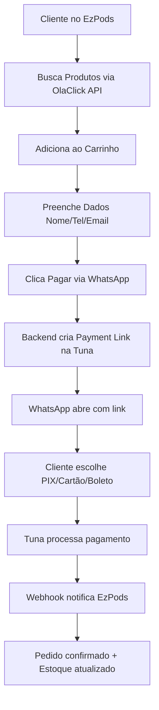

# OlaClick + Tuna: Entendendo a Integração

## 🔍 Situação Atual do EzPods

O EzPods usa a **API da OlaClick** apenas para **buscar produtos** (catálogo), mas **NÃO usa o checkout da OlaClick**.

```
EzPods → OlaClick API → Produtos
       ↓
       Checkout Próprio (implementado)
```

## 📊 Duas Abordagens Possíveis

### **Opção 1: Usar Checkout da OlaClick (com Tuna integrada)** ❌

**Como funciona:**
- OlaClick tem integração nativa com Tuna
- Você configura a Tuna no painel da OlaClick
- Usa o checkout hospedado pela OlaClick
- URL: `https://ezpods.ola.click`

**Vantagens:**
- ✅ Tuna já configurada
- ✅ Não precisa desenvolver checkout
- ✅ OlaClick gerencia tudo

**Desvantagens:**
- ❌ Perde controle sobre UX/UI
- ❌ Cliente sai do seu site
- ❌ Menos flexibilidade
- ❌ Não pode customizar fluxo
- ❌ **Não permite integração com WhatsApp customizada**

**Quando usar:**
- Se você quer usar a loja da OlaClick diretamente
- Se não precisa de customização

---

### **Opção 2: Integração Direta Tuna (implementada) ✅**

**Como funciona:**
- Seu site busca produtos da OlaClick (API)
- Checkout é no seu site (EzPods)
- Pagamento via Tuna API diretamente
- Fluxo customizado com WhatsApp

**Vantagens:**
- ✅ **Controle total sobre UX/UI**
- ✅ **Integração com WhatsApp customizada**
- ✅ Cliente não sai do seu site
- ✅ Flexibilidade total
- ✅ Pode adicionar features próprias
- ✅ Branding consistente

**Desvantagens:**
- ⚠️ Precisa configurar Tuna manualmente
- ⚠️ Mais código para manter

**Quando usar:**
- ✅ **Quando você quer checkout via WhatsApp** (seu caso!)
- ✅ Quando precisa de UX customizada
- ✅ Quando quer controle total

---

## 🎯 Recomendação para EzPods

**Use a Opção 2 (Integração Direta)** - que já está implementada!

### Por quê?

1. **WhatsApp é essencial**: A integração nativa da OlaClick não permite o fluxo via WhatsApp que você quer
2. **Controle total**: Você pode customizar todo o processo
3. **Melhor UX**: Cliente fica no seu site o tempo todo
4. **Já está pronto**: A implementação já foi feita!

---

## 🔧 Como Configurar (Opção 2 - Recomendada)

### 1. Criar Conta na Tuna (Diretamente)

```bash
# Acesse:
https://console.tuna.uy

# Crie sua conta (não pela OlaClick)
```

### 2. Obter Credenciais da Tuna

No console da Tuna:
1. Vá em **Settings** > **API Keys**
2. Copie:
   - `API Key`
   - `App Token`

### 3. Configurar Webhook

No console da Tuna:
1. Vá em **Settings** > **Webhooks**
2. Configure a URL:
   ```
   https://ezpods.vercel.app/api/webhooks/tuna
   ```
3. Copie o `Webhook Secret`

### 4. Adicionar ao .env

```bash
# Tuna Payment Gateway (Integração Direta)
TUNA_API_KEY=sua_api_key_aqui
TUNA_APP_TOKEN=seu_app_token_aqui
TUNA_API_URL=https://sandbox.tuna.uy/api  # sandbox para testes
TUNA_WEBHOOK_SECRET=seu_webhook_secret

# WhatsApp
WHATSAPP_BUSINESS_NUMBER=5511999999999
```

### 5. Criar Tabela no Banco

```bash
psql $DATABASE_URL < scripts/create-orders-table.sql
```

### 6. Testar no Sandbox

```bash
# Use credenciais de sandbox primeiro
TUNA_API_URL=https://sandbox.tuna.uy/api

# Teste o fluxo completo:
1. Adicionar produtos ao carrinho
2. Preencher dados do cliente
3. Clicar em "Pagar via WhatsApp"
4. Verificar redirecionamento
5. Testar pagamento PIX no sandbox
```

---

## 🔄 Fluxo Completo (Implementado)



---

## ❓ FAQ

### **P: Preciso configurar algo na OlaClick?**
**R:** Não! Você só usa a API deles para produtos. O pagamento é direto com a Tuna.

### **P: A OlaClick vai processar os pagamentos?**
**R:** Não. A OlaClick só fornece o catálogo de produtos. Pagamentos são via Tuna diretamente.

### **P: Posso usar a conta Tuna da OlaClick?**
**R:** Não. Você precisa de uma conta Tuna própria para ter controle total e usar a API.

### **P: O que acontece com pedidos na OlaClick?**
**R:** Os pedidos ficam no seu sistema (banco de dados PostgreSQL). Você pode sincronizar com OlaClick depois se quiser.

### **P: Como sincronizar estoque?**
**R:** Atualmente, o estoque é lido da OlaClick (read-only). Quando um pagamento é confirmado, você pode:
- Opção A: Atualizar via API da OlaClick (se disponível)
- Opção B: Gerenciar estoque localmente
- Opção C: Usar webhook da OlaClick (se existir)

---

## 🚀 Próximos Passos

1. ✅ Criar conta na Tuna (diretamente)
2. ✅ Configurar credenciais no .env
3. ✅ Criar tabela orders no banco
4. ✅ Testar no sandbox
5. ✅ Configurar webhook
6. ✅ Testar fluxo completo
7. ✅ Migrar para produção

---

## 📞 Suporte

- **Tuna**: golive@tuna.uy
- **OlaClick**: https://help.olaclick.com/pt-br/help/kb-tickets/new

---

**Resumo**: Você está usando a abordagem correta! A integração direta com Tuna permite o fluxo via WhatsApp que você precisa. A OlaClick é usada apenas para o catálogo de produtos. 🎉
